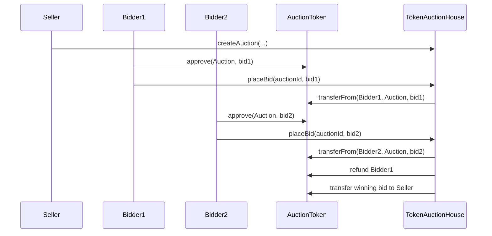

# Architecture

## Components

| Component | Role |
| --- | --- |
| `AuctionToken` | ERC-20 token used as the payment currency for every auction bid. |
| `TokenAuctionHouse` | Auction manager that stores auctions, accepts bids, refunds outbid users, and finalizes sales. |
| Front end | Browser DApp that connects MetaMask to the contracts using Ethers.js. |
| Sepolia | Public Ethereum test network used for deployment and verification. |

## Trust Boundaries

| Boundary | Risk | Mitigation |
| --- | --- | --- |
| Browser to wallet | User may sign the wrong transaction. | UI shows the action, auction ID, and bid amount before wallet confirmation. |
| Wallet to ERC-20 token | Contract cannot move bidder funds without approval. | Bidders approve only the intended bid amount. |
| ERC-20 token to auction contract | Failed token transfers could corrupt auction state. | Contract checks every token transfer result and reverts on failure. |
| Auction timing | Bids after deadline would be unfair. | `placeBid` checks `block.timestamp < endTime`. |
| Seller behavior | Seller could cancel after seeing a bid. | Cancellation is blocked once any bid exists. |

## Contract Flow

## Main State Variables

| Variable | Contract | Purpose |
| --- | --- | --- |
| `balanceOf` | `AuctionToken` | Tracks ERC-20 balances. |
| `allowance` | `AuctionToken` | Tracks approved spender amounts. |
| `auctionCount` | `TokenAuctionHouse` | Provides sequential auction IDs. |
| `auctions` | `TokenAuctionHouse` | Stores seller, metadata, bidding state, and status. |
| `bidToken` | `TokenAuctionHouse` | Immutable ERC-20 token used for bids. |

## Important Events

| Event | Meaning |
| --- | --- |
| `AuctionCreated` | Seller opened a new auction. |
| `BidPlaced` | A bidder became the highest bidder. |
| `PreviousBidRefunded` | The former highest bidder received their escrowed tokens back. |
| `AuctionCancelled` | Seller cancelled an auction with no bids. |
| `AuctionFinalized` | Auction closed and payment was released to the seller. |
